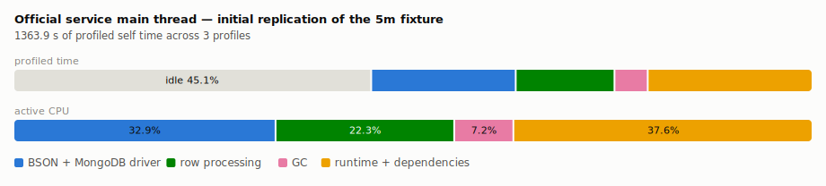
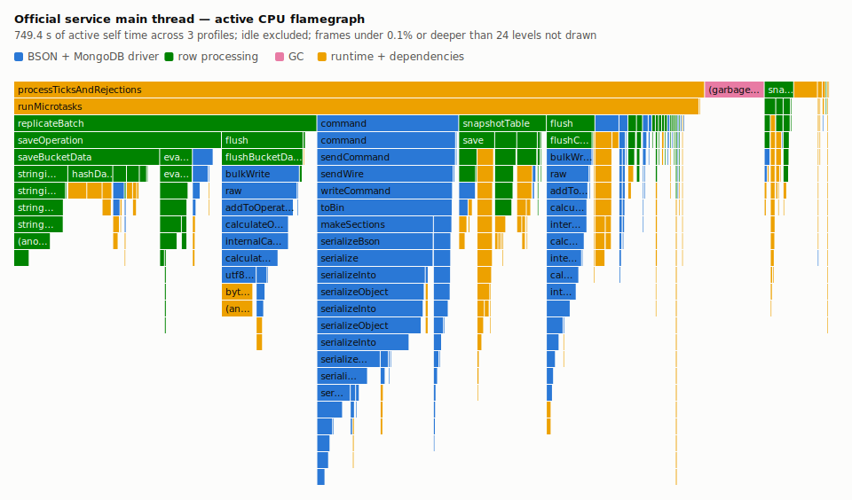

# powersync-mdbx

An independent Rust/MDBX implementation of PostgreSQL-to-PowerSync bucket replication. It reads a consistent snapshot, materializes bucket state, follows logical replication, and serves the covered data through `/sync/stream`.

This project is not affiliated with, endorsed by, or supported by PowerSync or Journey Mobile, Inc. It is not a fork of the PowerSync service or a drop-in replacement. The PowerSync name identifies the protocol and service used for comparison.

## Motivation

Initial replication has been an operational bottleneck in a large deployment. This repository implements and evaluates an embedded ordered store and purpose-built materialization path for reducing the time from service start to protocol-observable readiness.

The comparison changes the language, runtime, storage engine, data layout, and parts of the service architecture. It cannot isolate MongoDB, Node.js, Rust, MDBX, or any other component as the cause of a measured difference. A result here is evidence about this implementation and workload only.

## Status and scope

This is a working, correctness-gated implementation of the covered replication path and a benchmark platform for evaluating it. The implemented surface is narrower than the official service and is listed below.

The implemented path covers:

- a constrained compiler for the sync-rule forms used by the benchmark fixture;
- an initial PostgreSQL scan tied to an exported logical-replication snapshot;
- logical replication for inserts, updates, and deletes;
- MDBX layouts for current bucket state, ordered tail operations, routing indexes, parameter lookups, and checkpoint accumulators;
- initial and incremental `/sync/stream` responses for the supported request forms;
- JWT-derived routed subscriptions, including parameter-query buckets;
- exact count, checksum, operation-digest, authorization, and churn checks for selected buckets.

Out of scope:

- full PowerSync rule-language, protocol, SDK, or operational compatibility;
- online migration between storage or sync-rule generations;
- `TRUNCATE` support for materialized tables;
- PostgreSQL publication row filters, omitted columns, `publish_via_partition_root`, or partition/inheritance parent source tables;
- upload or CRUD APIs;
- partial-sync priority and full subscription-correlation semantics.

Unsupported layout-changing rule activation, publication transformations, and `TRUNCATE` fail closed. Publication coverage is validated at each bootstrap, not continuously; a publication altered while the service is streaming is rejected at the next restart. The full boundary is documented in [scope](docs/scope.md), [correctness](docs/correctness.md), and [security](SECURITY.md).

Deleting the complete state directory outside the managed reset path also deletes cursor-epoch history; clients must discard saved cursors after that operator action.

Table-backed parameter queries are materialized from the replication stream into MDBX and resolved with in-process reads at request time; no PostgreSQL connection is opened on the `/sync/stream` path. Bucket membership is still resolved once per request, so a change to access rows takes effect on the client's next reconnect, not mid-stream. A compile-time grammar restricts these queries to equality-keyed lookups against one public-schema table with text-family columns, failing closed on anything wider.

## Design

The logical slot exports the MVCC snapshot used by the initial scan. Replication then resumes from the slot's consistent point, closing the scan-to-WAL handoff gap.

MDBX holds the materialized state and replication tail in one local environment. Writes update current entries, routing indexes, parameter-lookup entries, ordered tail operations, and checkpoint accumulators transactionally. Each `/sync/stream` checkpoint pass reads all requested buckets in one short MDBX transaction, encodes pages lazily, and applies entry, byte, concurrency, and admission-time limits.

Bootstrap state includes the PostgreSQL source, slot, rules, snapshot marker, durable LSN, and cursor epoch. In unified mode, readiness opens only after the bootstrap is durable, source identity and publication coverage are revalidated, and logical replication is connected; it closes when the replication runner exits. An interrupted bootstrap can be reset only when its durable intent matches the inactive slot and source configuration.

TLS and JWT policy also fail closed: TCP PostgreSQL connections require either `verify-full` or an explicit `disable`, and configured JWT keys require exact audience and issuer policy.

## Why an embedded store, and why Rust

Initial materialization is one naturally serial write stream: a snapshot scan followed by a single logical-replication feed. This implementation keeps derived state in the process that derives it. A row is decoded, evaluated against the compiled rules, and written to an embedded ordered store in the same call stack; no storage client protocol, connection pool, or second storage service sits on the write path.

MDBX fits the shape of that stream. It is a memory-mapped B-tree with single-writer, multi-reader MVCC and durable copy-on-write commits: the replication stream is the one writer, checkpoint passes run as parallel read transactions that never block ingest, and key order directly serves the ordered bucket and tail range reads behind `/sync/stream`. There is no separate storage write-ahead log and no background compaction. Durability is not relaxed to gain speed; every commit runs under `SyncMode::Durable`, and the initial scan amortizes that cost by committing one transaction per 10,000-row batch rather than per row or per operation.

The initial scan also writes less than the steady-state path. Snapshot rows produce current-state documents, routing-index entries, and, for lookup tables, parameter-lookup entries; per-operation tail history starts at the replication handoff. Checkpoint counts and checksums are maintained as incremental accumulators inside the same transactions, so serving a checkpoint never rescans bucket contents.

Rust is there for the per-row loop and the memory profile. Decoding, rule evaluation, JSON normalization, and checksum accumulation run once per source row, more than five million times at the largest canary rung, without a garbage-collected runtime in the loop and with allocation under the implementation's control. Bounded streaming batches keep peak memory between 77 and 90 MiB across the rungs, and the service starts as one native process, which keeps its share of the measured startup-to-readiness window small.

These choices have visible costs. MDBX pages are uncompressed, and at the 5m rung the environment grew 7.73 GiB of allocated storage against 3.63 GiB for the official target's MongoDB volume, about 2.1x: the design trades disk for time. The single-writer model serializes ingestion. An embedded store binds storage to one node and one process, with no replica sets, no independent scaling of storage and service, and none of MongoDB's operational tooling.

## Current scale canary

Both targets ran as Linux containers on one Docker Desktop network with the same aggregate limit of 4 CPUs and 8 GiB. Rust received that limit directly. The official PowerSync 1.23.3 target assigned 1.5 CPUs/2 GiB to the service and 2.5 CPUs/6 GiB to MongoDB, with a 2 GiB WiredTiger cache. That allocation was selected by the repository's local calibration harness; the PowerSync team has not reviewed it.

The headline boundary is the first `/sync/stream` response that proves the expected state of one routed subscription through `checkpoint_complete`. Complete source materialization is measured separately using each implementation's internal completion contract. Every target started with an empty store.

<picture>
  <source media="(prefers-color-scheme: dark)" srcset="docs/artifacts/symmetric-canary/readiness-dark.svg">
  
</picture>

| Source task rows | Official protocol readiness | Rust/MDBX protocol readiness | Official / Rust |
| ---: | ---: | ---: | ---: |
| 250,202 | 20.46 s | 1.74 s | 11.74x |
| 1,000,402 | 63.56 s | 5.87 s | 10.83x |
| 2,000,802 | 146.06 s | 12.24 s | 11.93x |
| 5,001,002 | 356.87 s | 32.18 s | 11.09x |

Official protocol-readiness elapsed time was 10.83x to 11.93x the Rust/MDBX elapsed time across the four rungs. These are four single-run scale-canary ratios, not estimates of a latency distribution. The run order was official then Rust at every rung, and OS and PostgreSQL caches were not flushed.

The target-specific complete-materialization observers recorded 19.71/1.77 s, 62.82/5.76 s, 145.12/11.99 s, and 356.05/31.28 s for official/Rust. They are implementation-specific diagnostic boundaries, not a shared protocol metric, so no cross-target ratio is claimed from them.

Both targets passed exact selected-bucket initial-state and incremental-churn checks at every rung, including authorization isolation, checkpoint count/checksum recurrence, and client-visible PUT/REMOVE semantics. The verifier checked 200, 100, 100, and 50 routed buckets; the corresponding initial proofs covered 100,082, 100,042, 100,042, and 100,022 PUT operations per target.

Initial-window resource evidence was captured from Linux cgroup v2 and container `/proc` counters:

| Rows | Official CPU, service + MongoDB | Rust CPU | Official peak memory, service / MongoDB | Rust peak memory | Official / Rust allocated storage growth | Official / Rust inserted WAL |
| ---: | ---: | ---: | ---: | ---: | ---: | ---: |
| 250,202 | 24.36 CPU-s | 1.27 CPU-s | 242 / 1,570 MiB | 80 MiB | 0.17 / 0.39 GiB | 0.53 / 0.27 MiB |
| 1,000,402 | 76.62 CPU-s | 4.15 CPU-s | 257 / 2,693 MiB | 77 MiB | 0.69 / 1.56 GiB | 2.27 / 0.03 MiB |
| 2,000,802 | 187.29 CPU-s | 8.71 CPU-s | 258 / 3,665 MiB | 82 MiB | 1.42 / 3.11 GiB | 3.41 / 0.33 MiB |
| 5,001,002 | 490.15 CPU-s | 23.50 CPU-s | 274 / 5,922 MiB | 90 MiB | 3.63 / 7.73 GiB | 5.88 / 2.68 MiB |

Memory values are cgroup lifetime peaks, so MongoDB includes provisioning before the measured window. Inserted WAL is the cluster-wide WAL-position delta during the window. Network counters are reported per component rather than summed because service-to-MongoDB traffic appears in both namespaces. The checked-in [canary artifact](docs/artifacts/symmetric-canary/README.md) contains the exact timings, boundaries, CPU, peak memory, block I/O, per-component network traffic, storage growth, WAL, tested commit, image identities, and gate counts.

### Reading the results

The resource evidence constrains how the ratios can be explained. The following observations are arithmetic on the recorded values, except the profiling figures, which cite their own labeled diagnostic artifact.

Both targets scale close to linearly. Official protocol readiness stays between 63.5 and 81.8 s per million source task rows across the rungs, Rust between 5.8 and 7.0 s per million, and the ratio between 10.8x and 11.9x over a twentyfold row-count range. The measured difference is a per-row cost factor, not a difference in asymptotic behavior.

The CPU gap is larger than the elapsed-time gap. At the 5m rung the official target consumed 490.15 CPU-s across service and MongoDB against 23.50 CPU-s for Rust, a factor of 20.9, or roughly 98 µs against 5 µs of CPU per source task row; the 250k, 1m, and 2m rungs show 19.2x, 18.5x, and 21.5x. The allocation was not the binding constraint on average: over the 5m initial window the official service averaged 0.68 of its 1.5 CPUs, MongoDB 0.70 of its 2.5, and the Rust service 0.73 of its 4. Window averages do not rule out short bursts at the limits.

Moving derived state dominates the official target's traffic. Within the 5m initial window MongoDB's receive counter recorded 9.31 GiB, matching the service's transmit; the Rust service, whose inbound traffic is essentially the PostgreSQL scan, received 1.27 GiB and transmitted 2.6 MiB. Its derived writes go to the in-process MDBX map and never cross a socket. Peak memory shows the same shape: 90 MiB for Rust against 274 MiB for the official service plus 5,922 MiB for MongoDB.

A separate diagnostic run attributes part of the official target's CPU cost directly: V8 profiles of the service's main thread over three initial replications of the 5m fixture, uncapped and official-only, rolled up in the [profile artifact](docs/artifacts/official-cpu-profile-5m/README.md).

<picture>
  <source media="(prefers-color-scheme: dark)" srcset="docs/artifacts/official-cpu-profile-5m/attribution-dark.svg">
  
</picture>

<picture>
  <source media="(prefers-color-scheme: dark)" srcset="docs/artifacts/official-cpu-profile-5m/flamegraph-dark.svg">
  
</picture>

Even with the container's CPU limit removed, the main thread was off-CPU 45.1% of profiled time, and marshalling derived state through BSON and the MongoDB driver cost more active CPU than all of the service's own row processing; garbage collection on that thread was 7.2%. These shares do not combine with canary values, and MongoDB — slightly more than half the official target's total CPU at this rung — is outside the profile.

The evidence is not one-sided. Rust's allocated storage grew 7.73 GiB at the 5m rung against the official target's 3.63 GiB; uncompressed on-disk state is part of the price of the write path described above.

What remains hypothesis rather than measurement: whether the idle main thread is waiting on storage round trips, how MongoDB spends its server-side CPU, and the cost of persisting per-operation history with checkpoint checksums computed from stored operations, where this implementation writes current state once and maintains incremental accumulators. As stated in Motivation, a comparison that changes the language, runtime, storage engine, and data layout at once cannot isolate any one component as the cause of the end-to-end ratio.

The canary took 16 minutes 52 seconds and retained about 13 GiB locally. It ran in Docker Desktop's Linux VM rather than on controlled native Linux hardware. Official, MongoDB, and PostgreSQL images were digest-pinned; the locally built Rust image was executed and recorded by immutable image ID. A repeated, counterbalanced native-Linux matrix remains the appropriate next step for distributional performance claims.

Local release checks passed 255 Rust tests, four live PostgreSQL replication tests, and 69 Node harness/export/ladder tests, along with formatting, warnings-denied Clippy, dependency audits, and the frontend build.

The other compact artifacts under `docs/artifacts/` are the CPU-profile rollup above and older exploratory runs from asymmetric topologies and earlier implementation revisions. The [benchmark methodology](docs/benchmark.md) defines the claim boundary for each result.

## Build and test

Requirements:

- the Rust toolchain pinned in `rust-toolchain.toml`;
- Node.js 24 LTS;
- Docker with Compose;
- PostgreSQL 13 or newer for a replication source; the benchmark and live suite use PostgreSQL 16;
- a C/C++ toolchain, `libclang`, `pg_config`, and PostgreSQL client development libraries.

Run the local checks:

```sh
npm --prefix e2e/official-sdk ci
cargo fmt -- --check
cargo clippy --locked --workspace --all-targets -- -D warnings
cargo test --locked -q
node --check scripts/user_value_benchmark.mjs
node --check scripts/resource_evidence.mjs
node --check scripts/official_resource_calibration.mjs
node --check scripts/linux_canary_ladder.mjs
node --check scripts/export_artifacts.mjs
node --check scripts/export_canary_ladder.mjs
node --check scripts/public_resource_evidence.mjs
node --check scripts/profile_rollup.mjs
node --check scripts/profile_charts.mjs
node --check scripts/canary_chart.mjs
node --test scripts/*.test.mjs
npm --prefix e2e/official-sdk audit
npm --prefix e2e/official-sdk run build
cargo audit
```

The four ignored live-replication tests require PostgreSQL with logical WAL enabled. The repository CI configuration shows the required database setup, but the checks above can all be run locally.

## Benchmark workflow

Benchmark cost is intentionally tiered.

1. Ordinary changes run the local checks only.
2. Changes to ingestion, storage, protocol output, readiness, or the harness run a small symmetric-container smoke test.
3. A release candidate runs the bounded 250k/1m/2m/5m ladder once.
4. Distributional, variance, or tail-latency claims use a frozen commit and a separate repeated matrix on controlled native Linux hardware.

Build the Linux benchmark image:

```sh
docker build -f Dockerfile.benchmark -t powersync-mdbx:benchmark .
```

Run a small symmetric smoke test:

```sh
POWERSYNC_USER_VALUE_RUNTIME=symmetric-docker \
POWERSYNC_USER_VALUE_RUST_IMAGE=powersync-mdbx:benchmark \
POWERSYNC_USER_VALUE_RUST_IMAGE_PULL=0 \
POWERSYNC_USER_VALUE_TARGET_CPUS=4 \
POWERSYNC_USER_VALUE_TARGET_MEMORY=8g \
POWERSYNC_USER_VALUE_SERVICE_CPUS=1.5 \
POWERSYNC_USER_VALUE_SERVICE_MEMORY=2g \
POWERSYNC_USER_VALUE_MONGO_CPUS=2.5 \
POWERSYNC_USER_VALUE_MONGO_MEMORY=6g \
POWERSYNC_USER_VALUE_MONGO_CACHE_GB=2 \
POWERSYNC_USER_VALUE_OFFICIAL_NODE_OPTIONS=--max-old-space-size-percentage=80 \
POWERSYNC_RUST_ALLOW_COMPARISON=1 \
POWERSYNC_USER_VALUE_PROFILE=smoke \
POWERSYNC_USER_VALUE_PROCESSING_ONLY=1 \
POWERSYNC_USER_VALUE_ACCESS_MODE=auth_perimeter \
POWERSYNC_USER_VALUE_EQUIVALENCE_GATE=1 \
POWERSYNC_USER_VALUE_CHURN_GATE=1 \
POWERSYNC_USER_VALUE_CHURN_GATE_MODE=slot-lsn \
POWERSYNC_USER_VALUE_INITIAL_READINESS=sync-protocol \
POWERSYNC_USER_VALUE_PROJECT_BUCKET_SAMPLES=6 \
POWERSYNC_USER_VALUE_RETAIN_RAW_RECORDS=1 \
node scripts/user_value_benchmark.mjs
```

This command uses the recorded canary allocation.

Calibrate the official service/MongoDB CPU split at 250k before an expensive matrix:

```sh
node scripts/official_resource_calibration.mjs
```

The calibration holds the aggregate 4 CPU/8 GiB budget, service and MongoDB memory limits, WiredTiger cache, dataset, and correctness gates constant. It runs the 1/3, 1.5/2.5, 2/2, and 2.5/1.5 CPU splits twice in opposite orders and retains complete initial resource evidence for every sample.

Run the bounded release ladder from a clean worktree:

```sh
node scripts/linux_canary_ladder.mjs
```

The ladder builds the Rust image, pins the official service, MongoDB, and PostgreSQL images, stops on the first failure, checks compressed raw records and resource evidence, and writes an append-only manifest under `tmp/linux-canary-ladder/`. It requires a Linux Docker server and checks for 150 GiB of free disk before the 5m rung. It is a correctness and scale-safety gate, not a statistical performance matrix.

The current harness records three initial-replication boundaries concurrently:

1. validated checkpoint completion for one routed subscription through `/sync/stream`;
2. target-specific evidence of complete initial source materialization through the fixture LSN;
3. the replication slot's `confirmed_flush_lsn` reaching that LSN.

The first is the common client-visible timing. The second is a target-specific diagnostic, not a common protocol metric. The official service reports an explicit completion flag and LSN; Rust exposes the LSN persisted atomically with its internal snapshot-complete marker, so completion is inferred from that implementation contract. The third records a source slot position, not a consumer acknowledgement or proof that every bucket is materialized.

Each repeat also records per-component CPU, cgroup lifetime peak memory, container init-process lifetime peak RSS, block I/O, network traffic, logical and allocated storage growth, and the cluster-wide inserted WAL-position delta. These high-water marks are lifetime diagnostics, not measurement-window peaks; MongoDB can include provisioning before the baseline. The runner reads container cgroup v2 and `/proc` counters directly, using `docker exec` when the Docker host is not local. Docker stats remains an incomplete fallback. Component network counters are not summed because service-to-storage traffic appears in more than one namespace.

Repeated publication matrices additionally require a Linux host running the symmetric-container topology, immutable image digests including the Rust image, retained raw records, a clean tree, interleaved target order, warmups, at least 20 measured pairs, complete Linux cgroup/proc resource evidence, and explicit attestations for official-service tuning, storage class, and durability policy. `POWERSYNC_USER_VALUE_PUBLIC_RUN=1` enforces those controls, requires target-specific storage and durability descriptions, and persists them in the artifact. The complete methodology and configuration controls are in [docs/benchmark.md](docs/benchmark.md).

## Repository layout

- `crates/powersync-mdbx/`: compiler, replication, MDBX storage, protocol, and HTTP service;
- `scripts/user_value_benchmark.mjs`: paired benchmark and correctness harness;
- `scripts/official_resource_calibration.mjs`: counterbalanced 250k official-service resource calibration;
- `scripts/linux_canary_ladder.mjs`: bounded release-candidate ladder;
- `scripts/resource_evidence.mjs`: Linux cgroup/proc and storage/WAL accounting;
- `scripts/profile_rollup.mjs`: official-service CPU-profile category rollup;
- `scripts/profile_charts.mjs`: attribution and flamegraph figures from those profiles;
- `scripts/canary_chart.mjs`: readiness figure from the canary summary;
- `e2e/official-sdk/`: protocol validation using the PowerSync JavaScript packages;
- `docs/`: scope, correctness boundary, methodology, and historical artifacts.

## Contributing

Contributions that improve correctness, benchmark fairness, or the official baseline are welcome. Benchmark changes must document any change to the measured interval, readiness boundary, dataset, protocol gate, deployment topology, or target tuning. See [CONTRIBUTING.md](CONTRIBUTING.md).

## License

Apache-2.0. See [LICENSE](LICENSE) and [third-party notices](THIRD-PARTY-NOTICES.md).
