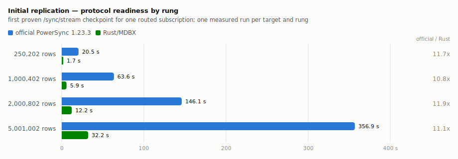

# Symmetric scale canary

This artifact records one passing 250k/1m/2m/5m scale ladder for commit `f56050bb7c9098b9e3f5f84806f802fa512b7ea8`. It is a correctness and scale canary with one measured run per target and rung, not a repeated performance matrix.

Both targets ran in Linux containers on the same Docker Desktop network. Each target had an aggregate limit of 4 CPUs and 8 GiB. Rust received the full limit. The official PowerSync 1.23.3 target split it into 1.5 CPUs/2 GiB for the service and 2.5 CPUs/6 GiB for MongoDB; WiredTiger used a 2 GiB cache. That allocation came from the repository's local calibration harness and was not reviewed by the PowerSync team.

## Initial replication

Protocol readiness is the first successful expected-state proof for one routed subscription through `/sync/stream` and `checkpoint_complete`. Complete materialization is a separate target-specific boundary. The official service reports initial replication completion and its LSN; Rust persists the source LSN atomically with its internal snapshot-complete marker.

<picture>
  <source media="(prefers-color-scheme: dark)" srcset="readiness-dark.svg">
  
</picture>

The figure is generated from [canary-summary.json](canary-summary.json) by `scripts/canary_chart.mjs`.

| Source task rows | Official protocol readiness | Rust/MDBX protocol readiness | Official / Rust |
| ---: | ---: | ---: | ---: |
| 250,202 | 20.465 s | 1.743 s | 11.740x |
| 1,000,402 | 63.556 s | 5.870 s | 10.827x |
| 2,000,802 | 146.061 s | 12.242 s | 11.931x |
| 5,001,002 | 356.867 s | 32.180 s | 11.090x |

Every rung ran the official target first and Rust second from an empty target store. OS and PostgreSQL caches were not flushed. The ratios describe these runs only.

| Source task rows | Official complete-materialization diagnostic | Rust/MDBX complete-materialization diagnostic |
| ---: | ---: | ---: |
| 250,202 | 19.712 s | 1.768 s |
| 1,000,402 | 62.822 s | 5.761 s |
| 2,000,802 | 145.120 s | 11.993 s |
| 5,001,002 | 356.049 s | 31.276 s |

The completion observers use different implementation contracts, so no cross-target ratio is computed from this table.

## Correctness gates

Both targets passed the initial-state and incremental-churn gates at every rung. The verifier compared the selected bucket set, expected and observed counts, checkpoint counts and checksums, client operation digests, PUT digests, semantic digests, authorization isolation, and incremental PUT/REMOVE semantics.

| Source task rows | Routed buckets | Initial PUTs per target | Churn PUTs per target | Churn REMOVEs per target |
| ---: | ---: | ---: | ---: | ---: |
| 250,202 | 200 | 100,082 | 4,000 | 2,000 |
| 1,000,402 | 100 | 100,042 | 2,000 | 1,000 |
| 2,000,802 | 100 | 100,042 | 2,000 | 1,000 |
| 5,001,002 | 50 | 100,022 | 1,000 | 500 |

## Initial-window resource evidence

CPU is cumulative CPU time. Memory is the cgroup lifetime peak; MongoDB's value includes replica-set provisioning before the measured window. Storage is filesystem-allocated growth from the pre-start baseline. WAL is the PostgreSQL cluster-wide inserted-WAL-position delta during the initial window.

| Rows | Official CPU, service + MongoDB | Rust CPU | Official peak memory, service / MongoDB | Rust peak memory | Official / Rust allocated storage growth | Official / Rust inserted WAL |
| ---: | ---: | ---: | ---: | ---: | ---: | ---: |
| 250,202 | 24.36 CPU-s | 1.27 CPU-s | 242 / 1,570 MiB | 80 MiB | 0.17 / 0.39 GiB | 0.53 / 0.27 MiB |
| 1,000,402 | 76.62 CPU-s | 4.15 CPU-s | 257 / 2,693 MiB | 77 MiB | 0.69 / 1.56 GiB | 2.27 / 0.03 MiB |
| 2,000,802 | 187.29 CPU-s | 8.71 CPU-s | 258 / 3,665 MiB | 82 MiB | 1.42 / 3.11 GiB | 3.41 / 0.33 MiB |
| 5,001,002 | 490.15 CPU-s | 23.50 CPU-s | 274 / 5,922 MiB | 90 MiB | 3.63 / 7.73 GiB | 5.88 / 2.68 MiB |

The machine-readable [canary summary](canary-summary.json) retains each component's CPU, cgroup peak memory, process peak RSS, block reads and writes, network receive and transmit counters, storage growth, and both initial-window and full-run WAL deltas. Official component network counters are not summed because PowerSync-to-MongoDB traffic appears in both namespaces.

## Provenance

The ladder ran the local Rust image by immutable image ID `sha256:2e2f3663c88832a3f91e7c428feb9431d7228379876794395d5024fc4283c637`. PowerSync, MongoDB, and PostgreSQL inputs were pinned by registry digest; `canary-summary.json` records the digests only. The pinned official digest `sha256:b6b22fa7d0d862f04bdff62846e656756d17bcf3dd6eca399a0633671051438b` is the manifest-list digest of `journeyapps/powersync-service:1.23.3` on Docker Hub, which is where the version stated above comes from. The Docker server reported Linux/aarch64, 6 CPUs, and 16,748,593,152 bytes of memory.

The full ladder took 16 minutes 52 seconds. Compressed per-bucket validation records and full resource snapshots occupy about 13 GiB locally and are not checked into Git.
